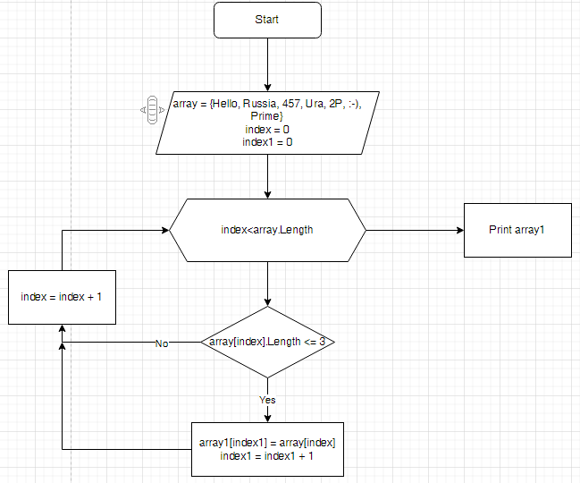

# ControlTack

# -* Итоговая контрольная работа по основному блоку

-** Описание задачи

Написать программу, которая из имеющегося массива строк формирует новый массив из строк,
длинна которых меньше, либо равна 3 символам. Первоначальный массив можно ввести с клавиатуры,
либо задать на старте выполнения алгоритма. При решении не рекомендуется пользоваться коллекциями,
лучше обойтись исключительно массивами.

